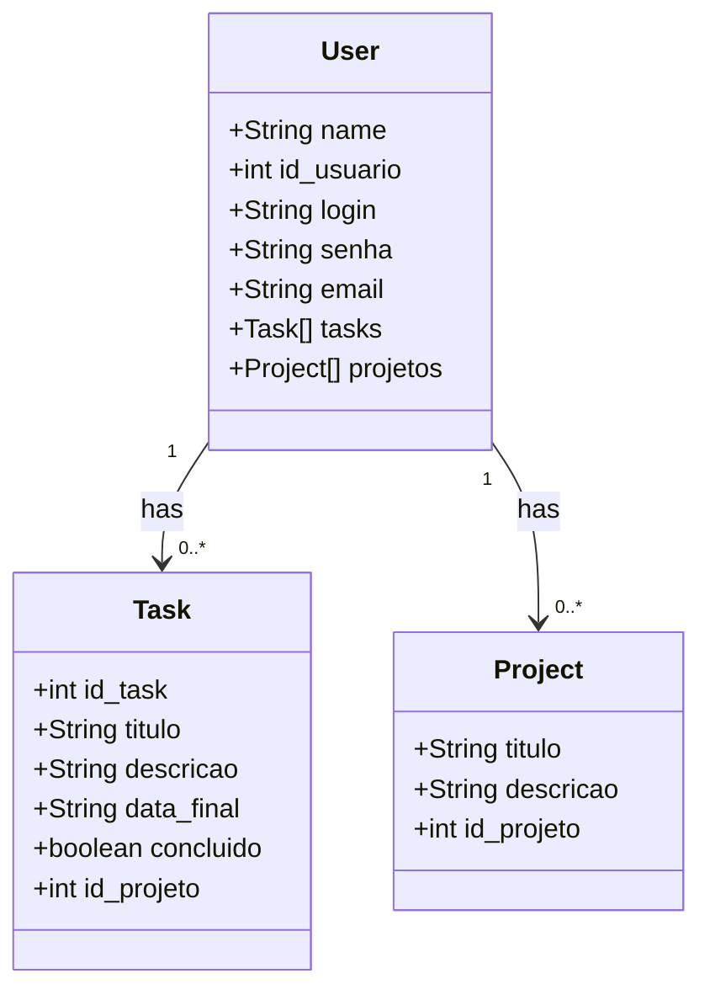

# todoList_restAPI

```mermaid
classDiagram
    class User {
        +String name
        +int id_usuario
        +String login
        +String senha
        +String email
        +Task[] tasks
        +Project[] projetos
    }

    class Task {
        +int id_task
        +String titulo
        +String descricao
        +String data_final
        +boolean concluido
        +int id_projeto
    }

    class Project {
        +String titulo
        +String descricao
        +int id_projeto
    }

    User "1" --> "0..*" Task : has
    User "1" --> "0..*" Project : has
```
