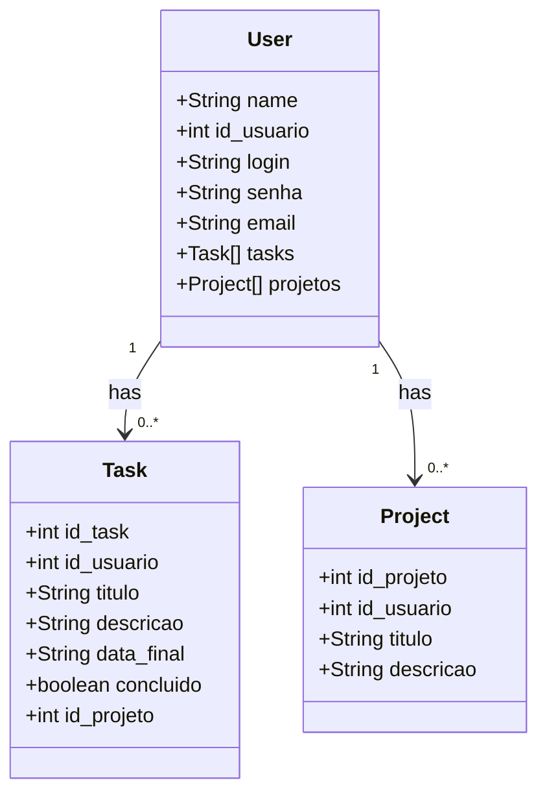

# todoList_restAPI


---

Run on the database console:

```sql

INSERT INTO tb_roles(name) VALUES('ROLE_USER');
INSERT INTO tb_roles(name) VALUES('ROLE_ADMIN');

```

# Urls:

http://localhost:8080/h2-console/login.jsp?jsessionid=aa5ceff966884716a10b34c56c361013 -> Acessar banco local
http://localhost:8080/swagger-ui/index.html#/user-rest-controller -> API doc